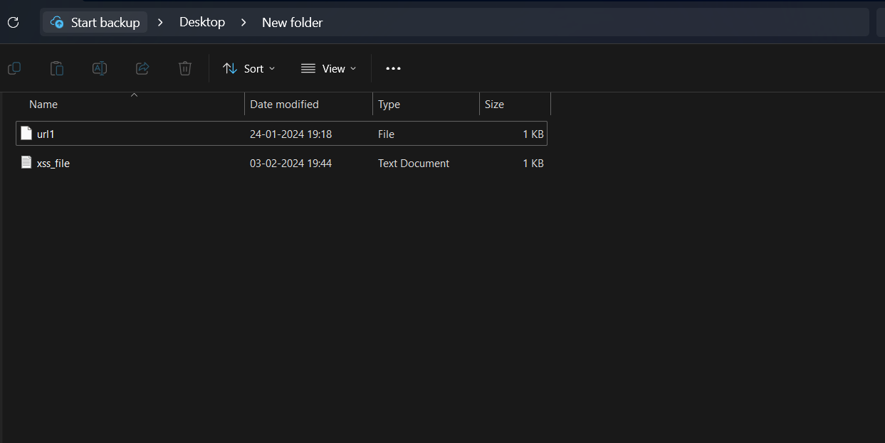
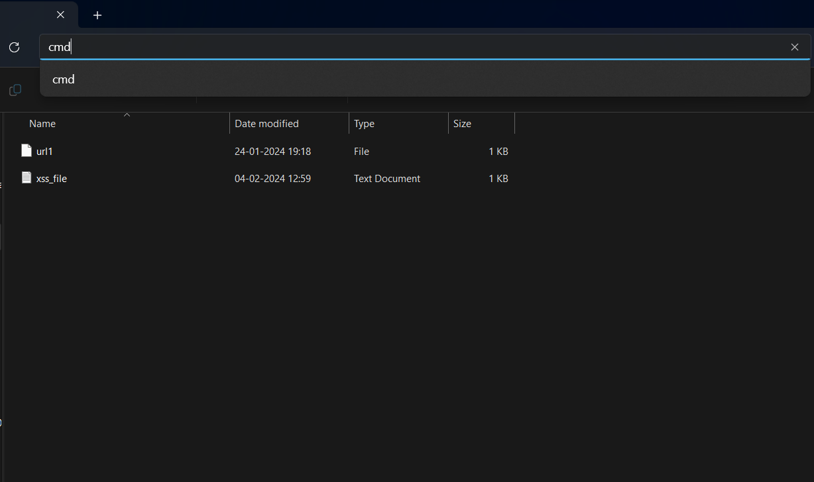
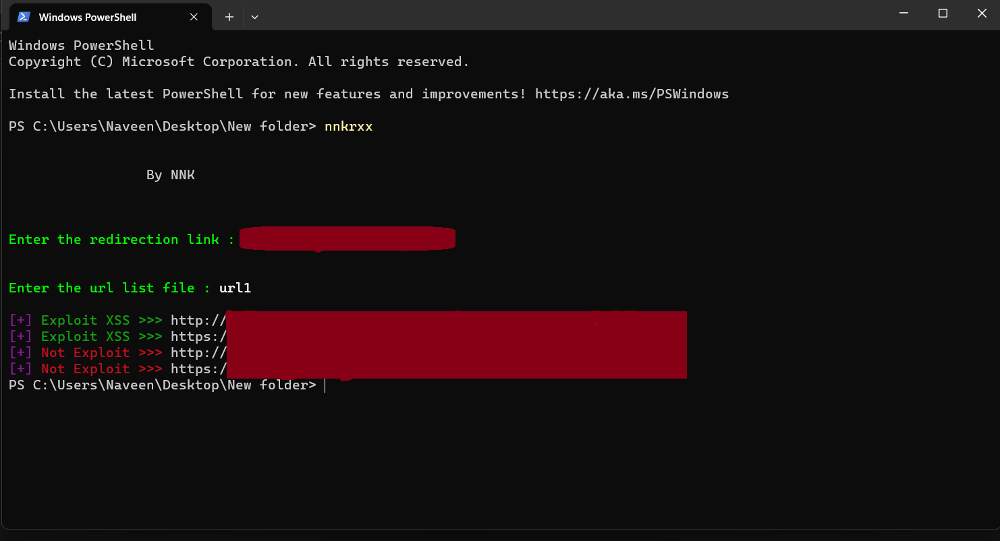

<h1 align="center">
    
</h1>

## Overview
This is the tool through which we can check whether the given url is vulnerable to CVE-2023-29489
## CVE-2023-29489
CVE-2023-29489 is a reflected cross-site scripting (XSS) vulnerability found in cPanel, a web hosting control panel software that is widely deployed across the internet. This vulnerability can be exploited without any authentication, and it is exploitable regardless of whether or not the cPanel management ports are exposed externally. This means that websites managed by cPanel on ports 80 and 443 are also vulnerable to the XSS attack.

The XSS vulnerability is due to the lack of sanitization of the message_html variable in the Cpanel::Server::Handlers::Httpd::ErrorPage module. This vulnerability can be exploited by sending a request to any of the cPanel management ports (2080, 2082, 2083, 2086) with a specially crafted URL that contains a malicious script. When the cPanel server responds to the request, it will include the malicious script in the response, which will then be executed by the user's web browser.

The impact of this vulnerability is that an attacker can execute arbitrary JavaScript code in the user's browser, potentially leading to the hijacking of a legitimate user's cPanel session. Once an attacker has gained access to a cPanel session, they can upload a web shell and gain command execution on the server.

The vulnerability has been assigned a CVSS v3 score of 6.1, indicating that it is a medium-severity vulnerability. The probability of exploitation activity in the next 30 days is estimated to be 0.23%, and the EPSS score is around 61%.

The vulnerability has been fixed in cPanel versions 11.102.0.31, 11.106.0.18, 11.108.0.13, and 11.109.9999.116. Users of cPanel are advised to upgrade to one of these versions to mitigate the vulnerability. Additionally, users can enable cPanel's auto-update functionality to ensure that their installation is always up-to-date with the latest security patches.

## Requirements
<div align="left">
    <a href="https://skillicons.dev">
        
    </a>
</div>    
Python installed on our system


pip installations:

````
pip install BeautifulSoup4
````
````
pip install shodan
````
````
pip install pystyle
````

## pip installing the package
````
pip install nnkrxx
````

## Usage
````
nnkrxx
````
run this in your terminal and after running the tool it will automatically ask you to enter the url which you want to redirect to and also the url file list which contains the list of all the urls which we will look for the vulnerability

## Implementation procedures:
<h2 align="left">Step 1:</h2>
Navigating to the folder where we are having the input file



<h2 align="left">Step 2:</h2>
OPening the command prompt in the folder which contains the input file



<h2 align="left">Step 3:</h2>
1.Typing the tool name in the terminal - nnkrxx and following the succeding steps asked after the initialitation of the tool in the terminal.



It checks for the r-xss vulnerability in the given url both in the http and https and it gives the output whether the given url is vulnerable to the particular CVE-2023-29489 and if it is found vulnerable it redirects to the url which you mentioned eariler during running the tool.


## Contact Me:
<div align="center"> 
  <a href="mailto:naveennithyakalyan@gmail.com">
    
  </a>
  <a href="https://www.linkedin.com/in/r-naveen-nithya-kalyan-5474bb1b7">
    
  </a>
</div>


 
